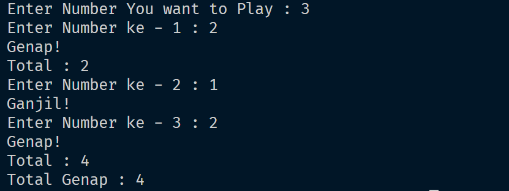
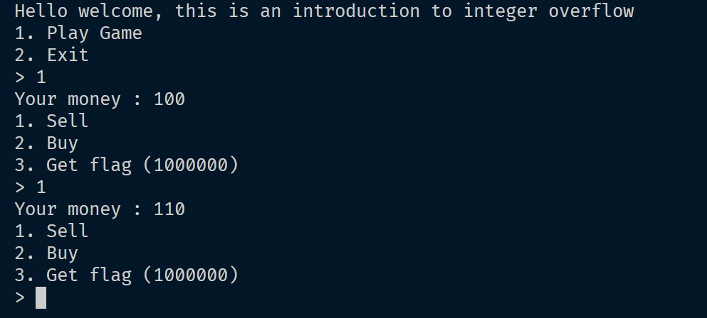
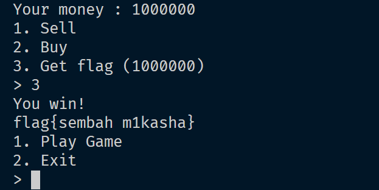

# RESPON ALPRO KELOMPOK 15 2024

Sebelum memulai Jangan Lupa Berdoa

> Terdapat 3 level yaitu
- Newbie
- Medium
- Sepuh bet
> Aturan
> 1. Tidak Diperkenankan Menggunakan library apapun selain iostream karena tidak dibutuhkan
> 2. Tidak diperkenankan Membuka open-AI. Kecuali Untuk level 3 bisa membuka browser tapi tanpa open-AI :V.
> 3. Setiap membuka Open-AI terdapat pengurangan point sebesar 70. Jadi dari total 100, kalian bisa buka open-AI tapi max nilai kalian adalah 30, itupun kalo bener semua

RESPON BERLISENSI DAN RAHASIA

[!] LICENCE

# Challenges
## LEVEL NEWBIE
> Author : m1kasha
### Select OddEven ^-^
```
Terdapat Program yang meminta input n buah bilangan yang menjadi jumlah perulangan di iterasi. Setiap iterasi meminta inputan dan terdapat seleksi ganjil genap. Kemudian Program menjumlah setiap bilangan yang termasuk genap

```
> Dokumtasi run program



## LEVEL MEDIUM
> Author : m1kasha

> Sebenernya Semua mudah cok yekan


```
Terdapat program game dengan 2 pilihan yaitu fibo dan cmp, untuk detail game nya adalah berikut. game fibo yaitu game yang meminta jumlah deret fibbo yang dinginkan lalu program mencetak sebanyak iterasi yang diberikan diawal. Game cmp yaitu game perbandingan inputan 1,2,3 dengan algoritma harus kalian pecahkan sendiri.

```

> Dokumentasi run program

### fibo


### cmp


## LEVEL SEPUH BET
> Author : m1kasha
### Intro To Integer Overflow 
Description : Do you Know Max and Min Int?
```
Terdapat Program Yang Bertema Shell dan Buy Dimana Program akan meminta user bermain dengan modal awal adalah uang sebesar 100. Terdapat 3 pilihan dalam game yaitu shell, buy, dan get FLAG. Pada Shell Terdapat Penambahan Point Setiap Melakukan Shell Yaitu 10 point. Dalam Menu Buy Terdapat inputan yang meminta user untuk memasukkan modal uang yang akan digunakan membeli ( barang tidak dipilih anggaplah sistem membeli sejumlah inputan yang dimasukkan aja :V). Setiap proses Buy Akan mengurangi sejumlah nilai yang dimasukkan. Terdapat menu terakhir yaitu FLAG, ini merupakan tujuan dari soal ini untuk mendapatkan FLAG. Namun ada syarat untuk mendapatkan flag yaitu nominal uang haruslah 1000000, tidak lebih tidak kurang. Game akan looping sebanyak 4 kali saja setiap satu kali bermain, setiap 4x looping terlewati maka game tereset.
```
> Dokumentasi run program

### MENU SELL


### MENU BUY


Gambar input disensor karena kunci jawaban.

### MENU GET FLAG



> Note

```
Tidak boleh memberikan kondisi untuk memberi uang langsung 1000000, karena source code akan di cek

```

> Keep Learning To Grow Your Mind, World Is Hard
