# HEYO ONE STEP AGAIN TO MODULE 6
```
Author : m1kasha
Time   : 2.5 Jam
```
3 Level again, max nilai :
- Level 1 -> 65
- Level 2 -> 80
- Level 3 -> 100

# LEVEL 1
## LEARN API IS URGENT ?
Terdapat sistem simulasi API dengan full header request juga. Terdapat 3 menu disini, yaitu method GET, POST serta see log POST. GET yaitu method yang mengirimkan data dan data tampil di url, sedangkan POST tidak tampil di url.

### GET

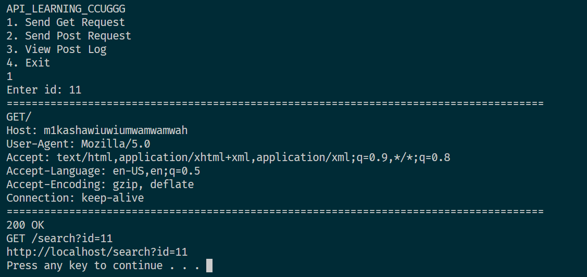


### POST

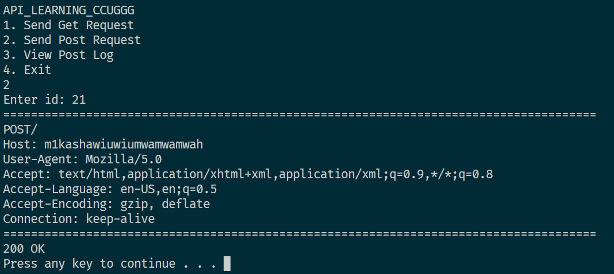

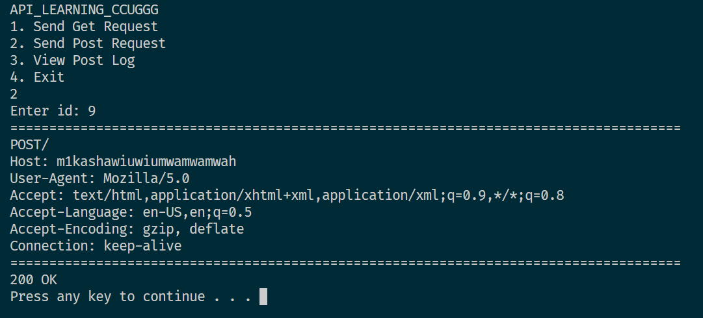

### SEE LOG POST

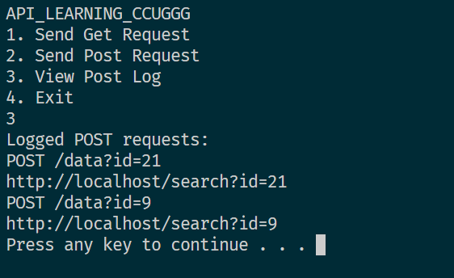


* NOTE : Terapkan function dengan pass by value dan pass by reference!

# LEVEL 2
## REGLOG
Program dengan register dan kode otp. Kemudian user harus login dengan otp yang benar agar akun aktif

### REGIST

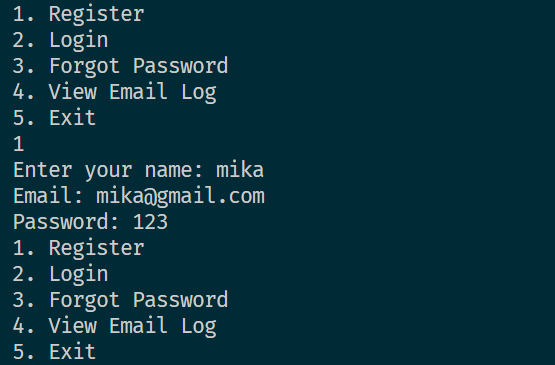


### LIHAT OTP SEBELUM LOGIN

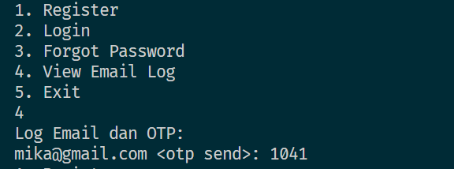

### MENCOBA LOGIN DENGAN OTP SALAH DULU

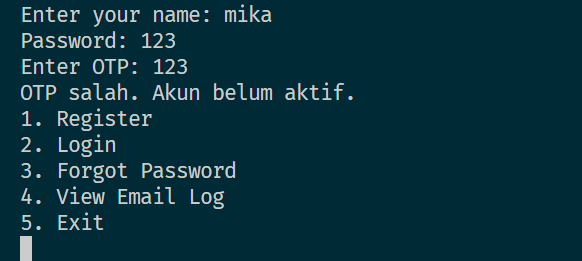

### LOGIN DENGAN OTP BENAR

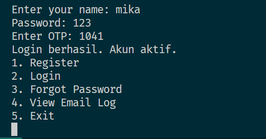


### BERIKUT FUNGSI UNTUK GENERATE OTP

```c++
int generate_key() {
    // Menghasilkan 4 digit angka acak
    int random = rand() % 9000 + 1000;
    return random;
}
```

# LEVEL 3
## DON'T HIT MY WALL AH
Terdapat Pilihan Sebagai berikut di program ini

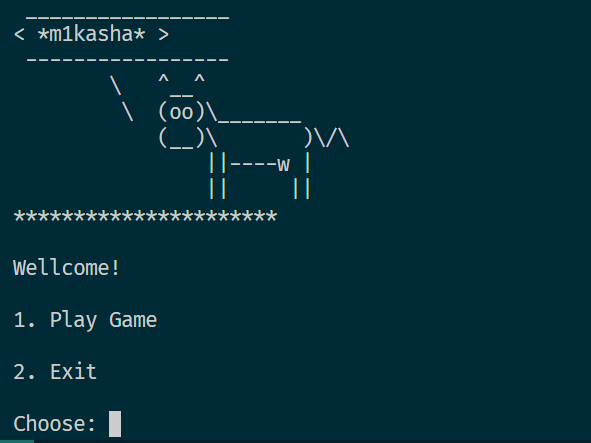

Saat memilih Game masuk ke game labirin yang jika bisa melewati lintasan yang disediakan akan menang, sedangkan jika menabrak yang bukan lintasan akan kalah

### PLAY GAME

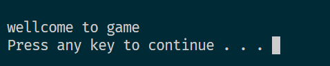

posisi awal sebagai berikut

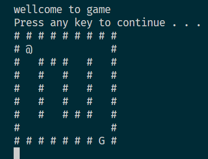

lintasan buat statis dan ikuti program yang dibuat sebagai soal respon

output .exe saya sertakan sebagai gambaran

* kondisi kalah
ketika mengenai pagar # maka kalah

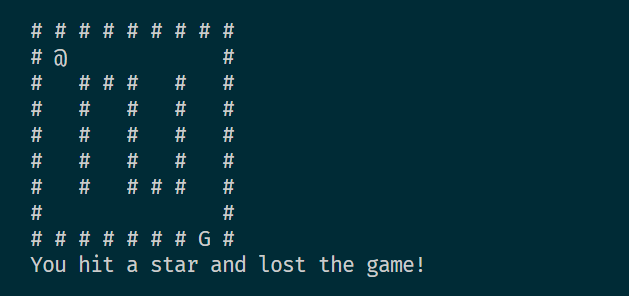

* kondisi menang

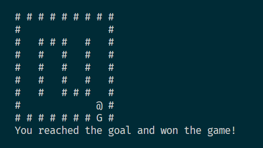

hint code
```c++
switch (key) {
        case 72: // Panah Atas
            // Periksa apakah pergerakan akan membawa hero keluar dari batas atas papan permainan
            if (newHeroX > 0) {
                newHeroX--; // Kurangi posisi X hero (bergerak ke atas)
            }
            break;
        case 80: // Panah Bawah
            // Periksa apakah pergerakan akan membawa hero keluar dari batas bawah papan permainan
            if (newHeroX < rows - 1) {
                newHeroX++; // Tambah posisi X hero (bergerak ke bawah)
            }
            break;
        case 75: // Panah Kiri
            // Periksa apakah pergerakan akan membawa hero keluar dari batas kiri papan permainan
            if (newHeroY > 0) {
                newHeroY--; // Kurangi posisi Y hero (bergerak ke kiri)
            }
            break;
        case 77: // Panah Kanan
            // Periksa apakah pergerakan akan membawa hero keluar dari batas kanan papan permainan
            if (newHeroY < cols - 1) {
                newHeroY++; // Tambah posisi Y hero (bergerak ke kanan)
            }
            break;
        default:
            break;
    }


```
Code lintasan
```c++
char gameBoard[rows][cols] = {
        {'#', '#', '#', '#', '#', '#', '#', '#', '#'},
        {'#', ' ', ' ', ' ', ' ', ' ', ' ', ' ', '#'},
        {'#', ' ', '#', '#', '#', ' ', '#', ' ', '#'},
        {'#', ' ', '#', ' ', '#', ' ', '#', ' ', '#'},
        {'#', ' ', '#', ' ', '#', ' ', '#', ' ', '#'},
        {'#', ' ', '#', ' ', '#', ' ', '#', ' ', '#'},
        {'#', ' ', '#', ' ', '#', '#', '#', ' ', '#'},
        {'#', ' ', ' ', ' ', ' ', ' ', ' ', ' ', '#'},
        {'#', '#', '#', '#', '#', '#', '#', ' ', '#'}
    };

```
contoh inputan bisa kaliaan temukan di 