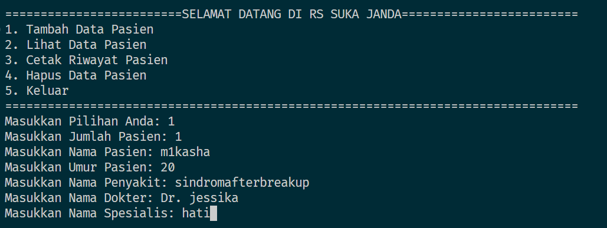
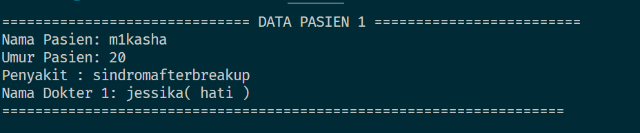
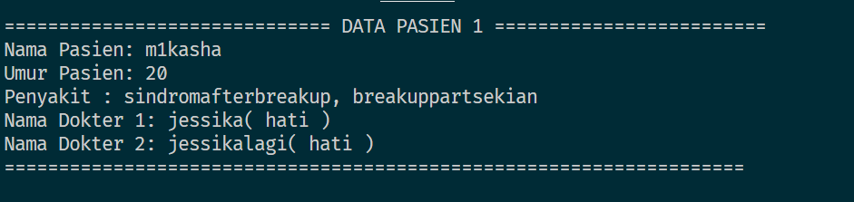
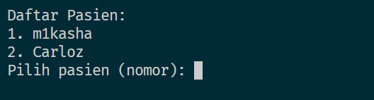
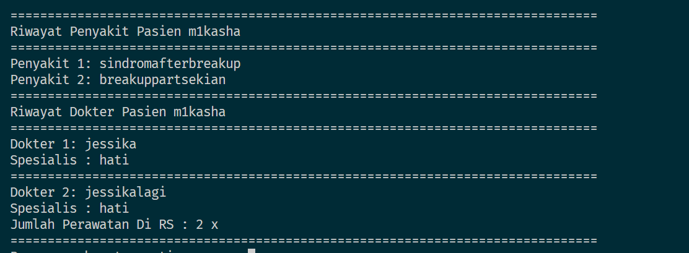

# RESPON MODUL 5 
## RUMAH SAKIT JESSIKA UWAW 

*note : waktu pengerjaan 1 jam 57 menit

Diberikan program berikut

Jika memilih 1

Jika memilih 2

*Kondisi ketika orang yang sama berobat lagi
saat memilih 2

*kondisi orang berbeda berobat

saat memilih 3

saat memilih pasien untuk riwayat

opsi hapus hanya pemanis 

* Note : Gunakan dan manfaatkan struct, juga direference & , semangat guys udh di modul 6 aja :, mengandung bawang